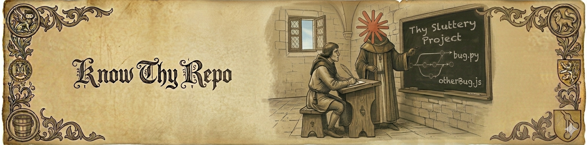

<p align="center">
  
</p>

<p align="center">
  Claude Code skills to help you get onboarded and up to date with your repository, stack, and architecture.
</p>

## What is this?

Three Claude Code skills that turn any git repository into an interactive learning environment:

| Skill | What it does |
|---|---|
| `/explore-thy-repo` | Scans the repo and saves structured knowledge (project details, tech stack, architecture) |
| `/learn-thy-repo` | Guided learning session — pick a topic and learn concepts one by one with real code examples |
| `/test-thy-knowledge` | Quiz mode — configurable format, question count, and scoring |

## Install

```bash
curl -fsSL https://raw.githubusercontent.com/dariuschira/know-thy-repo/main/install.sh | bash
```

That's it. Skills are now available in every Claude Code session.

<details>
<summary>Other installation methods</summary>

### From a local clone (enables auto-updates via git pull)

```bash
git clone git@github.com:dariuschira/know-thy-repo.git
cd know-thy-repo && ./install.sh
```

This symlinks instead of copying — `git pull` updates skills immediately.

### Uninstall

```bash
curl -fsSL https://raw.githubusercontent.com/dariuschira/know-thy-repo/main/install.sh | bash -s -- --uninstall
```

</details>

## Prerequisites

- [Claude Code](https://docs.anthropic.com/en/docs/claude-code) installed and authenticated

## Usage

### 1. Explore a repo

Navigate to any git repository and run:

```
/explore-thy-repo
```

This analyzes the repo and saves knowledge as three memory files:
- **Project** — structure, CI/CD, workflows, debugging, config
- **Tech Stack** — languages, frameworks, libraries, usage patterns
- **Architecture** — design patterns, data flow, key decisions

Run it again to refresh and verify existing knowledge.

### 2. Learn about the repo

```
/learn-thy-repo
```

Pick a learning track:
- **Project** — structure, workflows, CI/CD, debugging, configuration
- **Tech Stack** — languages, frameworks, libraries, how they're used
- **Architecture** — design principles, data flow, patterns, decisions

You can also jump straight to a track:

```
/learn-thy-repo tech stack
```

Concepts are taught one at a time with real code snippets from the repo. You control the pace.

### 3. Test your knowledge

```
/test-thy-knowledge
```

Configure your quiz:
- **Number of questions** (3-30, default 10)
- **Format**: multiple choice, single choice, text answer, or mixed
- **Topic focus**: project, tech stack, architecture, or all

Each answer is scored 0-10. You get a final report with strengths, weak areas, and suggestions.

You can also pass options directly:

```
/test-thy-knowledge 15 mixed
```

## Knowledge storage

Knowledge is stored in an isolated, skill-specific directory at `~/.claude/skill-data/know-thy-repo/`. Each project gets its own subdirectory scoped by path. Nothing is written to your project directory or to Claude's shared memory — no cleanup, no `.gitignore`, no interference with other skills.

## License

Apache 2.0 — see [LICENSE](LICENSE).
